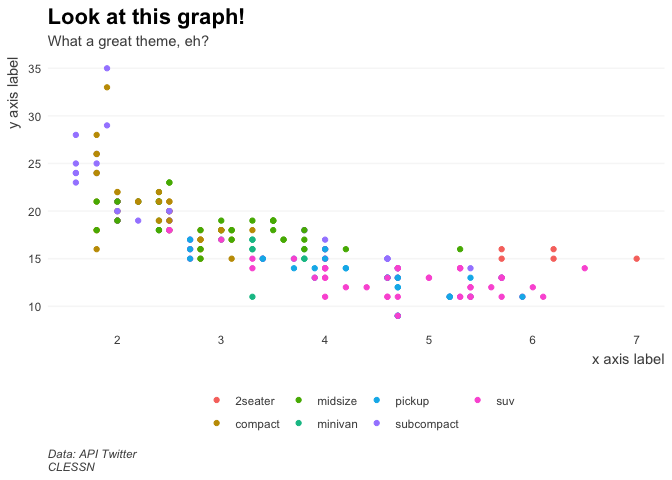
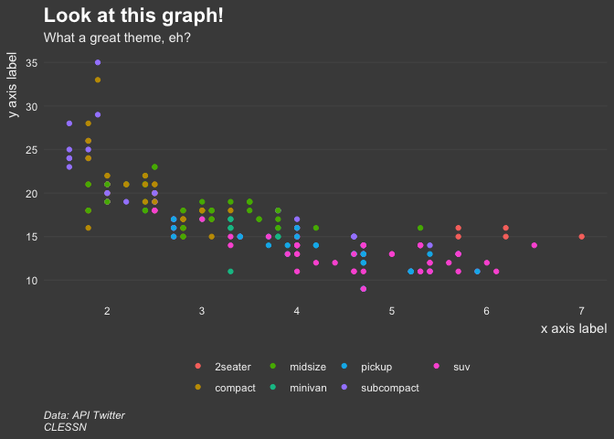
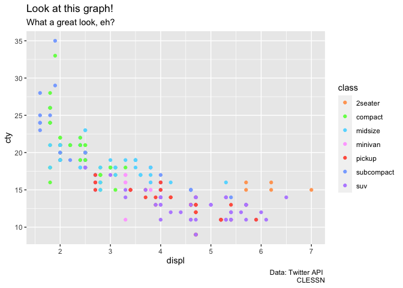

<!-- README.md is generated from README.Rmd. Please edit that file -->

# clessnverse

<!-- badges: start -->

[](https://github.com/clessn/clessnverse/actions/workflows/R-CMD-check.yaml)
<!-- badges: end -->

clessnverse contains functions for data domestication, analysis and
visualization along with functions specific to the research chair’s
projects.

*Note: This package is under construction.*

## Installation

To install the latest stable version of this package, run the following
line in your R console:

``` r
remotes::install_github("clessn/clessnverse")
```

## Usage

`library("clessnverse")` will load the following packages:

- [hublot](https://github.com/clessn/hublotr), to access clHub
- [clessnhub](https://github.com/clessn/hublotr), to access clessn hub

## Examples

### Wrangle data

Normalize a continuous variable between 0 and 1

``` r
library(clessnverse)

data <- tibble::tibble(a = c(1, 0, 2, 0), b = c(4, 0, 1, 0))

# Base R
sapply(data, normalize_min_max)
#>        a    b
#> [1,] 0.5 1.00
#> [2,] 0.0 0.00
#> [3,] 1.0 0.25
#> [4,] 0.0 0.00

# Dplyr
library("dplyr")

data %>%
  mutate(across(c(a, b), normalize_min_max))
#> # A tibble: 4 × 2
#>       a     b
#>   <dbl> <dbl>
#> 1   0.5  1   
#> 2   0    0   
#> 3   1    0.25
#> 4   0    0
```

### Analyse data

``` r
run_dictionary(
  data.frame(colnames(attitude)),
  text = colnames(attitude),
  dictionary = quanteda::data_dictionary_LSD2015
) %>% head()
#> 0.466 sec elapsed
#>   doc_id negative positive neg_positive neg_negative
#> 1  text1        0        0            0            0
#> 2  text2        1        0            0            0
#> 3  text3        0        1            0            0
#> 4  text4        0        1            0            0
#> 5  text5        0        0            0            0
#> 6  text6        1        0            0            0
```

### Visualise data

``` r
library("clessnverse")

p  <- ggplot2::ggplot(data = ggplot2::mpg) +
  ggplot2::geom_point(mapping = ggplot2::aes(x = displ, y = cty, colour = class)) +
  ggplot2::labs(title = "Look at this graph!",
                subtitle = "What a great theme, eh?",
                caption = "Data: API Twitter \nCLESSN") +
  ggplot2::xlab("x axis label") +
  ggplot2::ylab("y axis label")

p + theme_clean_light()
```



``` r
p + theme_clean_dark()
```



``` r

p  <- ggplot2::ggplot(data = ggplot2::mpg) +
  ggplot2::geom_point(mapping = ggplot2::aes(x = displ, y = cty, colour = class)) +
  ggplot2::labs(title = "Look at this graph!",
                subtitle = "What a great look, eh?",
                caption = "Data: Twitter API \nCLESSN")

p + scale_discrete_quorum(aesthetics = "colour")
```



## Issues and suggestions

You can submit bugs or suggestions in the Issues tab of this repo. To
facilitate problem solving, please include a [minimal reproducible
example](https://reprex.tidyverse.org/articles/reprex-dos-and-donts.html)
of the issue.
